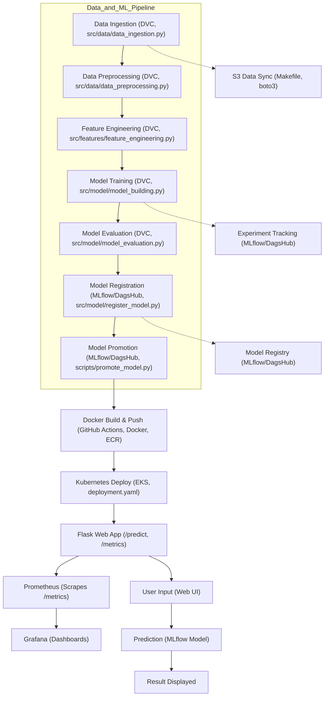

# Sentiment Analysis: End-to-End ML Pipeline with Cloud-Native Deployment

A full-stack, production-grade machine learning project for sentiment analysis, featuring robust data pipelines, experiment tracking, cloud storage, containerized deployment, and full-stack monitoring.

---

## Table of Contents
- [Project Overview](#project-overview)
- [Architecture & Flow](#architecture--flow)
- [Key Technologies](#key-technologies)
- [Architecture Flowchart](#architecture-flowchart)
- [Project Structure](#project-structure)
- [Setup & Installation](#setup--installation)
- [Data & Model Pipeline](#data--model-pipeline)
- [Web Application](#web-application)
- [Deployment](#deployment)
- [Monitoring & Observability](#monitoring--observability)
- [CI/CD](#cicd)
- [Testing](#testing)
- [Documentation](#documentation)
- [Contributing & License](#contributing--license)
- [Appendix](#appendix)

---

## Project Overview
A scalable, cloud-native ML pipeline for sentiment analysis, with:
- Automated data versioning and pipelines (DVC)
- Experiment tracking and model registry (MLflow + DagsHub)
- Cloud storage (AWS S3)
- Containerized web app (Flask + Docker)
- Orchestrated deployment (Kubernetes on AWS EKS)
- Monitoring and dashboards (Prometheus + Grafana)
- CI/CD automation (GitHub Actions)

---

## Architecture & Flow
- **Data Pipeline**: DVC orchestrates ingestion, preprocessing, feature engineering, model training, evaluation, and registration.
- **Cloud Storage**: Data and models are versioned and synced to AWS S3.
- **Experiment Tracking**: MLflow (hosted on DagsHub) logs parameters, metrics, and artifacts.
- **Model Registry**: MLflow Model Registry (via DagsHub) manages model lifecycle.
- **Web App**: Flask app for real-time predictions, containerized with Docker.
- **CI/CD**: GitHub Actions automates testing, Docker build, and deployment.
- **Deployment**: Docker image pushed to AWS ECR, deployed to AWS EKS (Kubernetes).
- **Monitoring**: Prometheus scrapes metrics from Flask app; Grafana visualizes them.

---

## Key Technologies
- **Python, Flask, scikit-learn, pandas, nltk**
- **DVC** for pipeline/data versioning
- **MLflow + DagsHub** for experiment tracking/model registry
- **AWS S3** for data/model storage
- **Docker** for containerization
- **Kubernetes (EKS)** for orchestration
- **Prometheus** for metrics scraping
- **Grafana** for dashboarding
- **GitHub Actions** for CI/CD

---

## Architecture Flowchart



---

## Project Structure
```
Sentiment-Analysis/
├── flask_app/                # Flask web app for sentiment prediction
│   ├── app.py                # Main Flask application
│   ├── load_model_test.py    # Model loading test script
│   ├── preprocessing_utility.py # Text preprocessing utilities
│   ├── requirements.txt      # Flask app dependencies
│   └── templates/
│       └── index.html        # Web UI template
│
├── src/                      # Core Python package
│   ├── connections/          # Cloud and DB connection utilities
│   │   ├── s3_connection.py  # AWS S3 integration
│   │   ├── ssms_connection.py# SQL Server integration
│   │   └── config.json
│   ├── data/                 # Data pipeline scripts
│   ├── features/             # Feature engineering
│   ├── logger/               # Logging utilities
│   ├── model/                # Model training, evaluation, registration
│   └── visualization/        # Visualization scripts
│
├── notebooks/                # Jupyter notebooks and experiments
├── models/                   # Trained models and vectorizers
├── scripts/                  # Utility scripts (e.g., promote_model.py)
├── tests/                    # Unit and integration tests
├── docs/                     # Sphinx documentation
├── deployment.yaml           # Kubernetes deployment/service
├── dvc.yaml, dvc.lock        # DVC pipeline files
├── requirements.txt          # Project-wide dependencies
├── Dockerfile                # Docker build for Flask app
├── Makefile                  # Automation commands (S3 sync, etc.)
├── .dvc/config               # DVC remote config (S3)
├── .github/workflows/        # GitHub Actions CI/CD
└── README.md                 # (You are here!)
```

---

## Setup & Installation
### 1. Clone the Repository
```bash
git clone <your-repo-url>
cd Sentiment-Analysis
```
### 2. Install Dependencies
- For the full project:
  ```bash
  pip install -r requirements.txt
  ```
- For the Flask app only:
  ```bash
  cd flask_app
  pip install -r requirements.txt
  ```
### 3. Configure Cloud & Tracking
- Set AWS credentials (for S3, ECR, EKS):
  - `AWS_ACCESS_KEY_ID`, `AWS_SECRET_ACCESS_KEY`, `AWS_REGION`
- Set DagsHub/MLflow token:
  - `CAPSTONE_TEST`
- DVC remote setup (S3):
  ```bash
  dvc remote add -d myremote s3://<your-bucket>
  dvc remote modify myremote access_key_id <AWS_ACCESS_KEY_ID>
  dvc remote modify myremote secret_access_key <AWS_SECRET_ACCESS_KEY>
  ```
- (Optional) Use a `.env` file for local secrets.

---

## Data & Model Pipeline
- **DVC**: Run the full pipeline with `dvc repro`.
- **S3**: Data and models are versioned and synced (see Makefile for sync commands).
- **MLflow/DagsHub**: All experiments, metrics, and models are logged and tracked.
- **Model Registry**: Models are promoted and managed via MLflow Model Registry (DagsHub UI).

---

## Web Application
- **Flask app**: Real-time predictions, Prometheus metrics at `/metrics`.
- **Endpoints**:
  - `/` : Home page with input form.
  - `/predict` : Handles prediction requests.
  - `/metrics` : Exposes Prometheus metrics for scraping.
- **Docker**:
  - Build: `docker build -t flask-app .`
  - Run: `docker run -p 5000:5000 flask-app`

---

## Deployment
- **Docker**: Image built and pushed to AWS ECR (see GitHub Actions workflow).
- **Kubernetes (EKS)**:
  - Deploy with: `kubectl apply -f deployment.yaml`
  - Service: LoadBalancer exposes the app on port 5000.
  - Secrets: K8s secrets for tokens/keys (see workflow and deployment.yaml).
- **CI/CD**: GitHub Actions automates build, test, push, and deploy.

---

## Monitoring & Observability
- **Prometheus**: Scrapes `/metrics` endpoint from Flask app.
- **Grafana**: Visualizes metrics (set up Prometheus as a data source, import dashboards).
- **Sample Prometheus scrape config**:
  ```yaml
  scrape_configs:
    - job_name: 'flask-app'
      static_configs:
        - targets: ['<flask-app-service-ip>:5000']
  ```
- **Grafana**: Import Prometheus as a data source, create dashboards for app and model metrics.

---

## CI/CD
- **GitHub Actions**:
  - Runs tests, builds Docker image, pushes to ECR, deploys to EKS.
  - See `.github/workflows/ci.yaml` for full pipeline.

---

## Testing
- **Unit/integration tests**: `pytest tests/`
- **CI**: Automated in GitHub Actions.

---

## Documentation
- **Sphinx**: Build with `make html` in `docs/`.
- See `docs/getting-started.rst` for setup instructions.

---

## Contributing & License
- Fork the repo, create a branch, add/commit changes, ensure all tests pass, and submit a PR.
- Licensed under the MIT License.

---

## Appendix
### Environment Variables
- `CAPSTONE_TEST` (DagsHub/MLflow token)
- `AWS_ACCESS_KEY_ID`, `AWS_SECRET_ACCESS_KEY`, `AWS_REGION` (for S3, ECR, EKS)
- (Optional) SQL Server credentials for data ingestion

### Prometheus & Grafana Setup (Local Dev)
- Use Docker Compose or manual setup to run Prometheus and Grafana locally.
- Example Prometheus config provided above.
- Grafana: Add Prometheus as a data source, import dashboards (JSON available in `docs/` or provide your own).

### Troubleshooting
- **DVC S3 issues**: Check AWS credentials and bucket permissions.
- **Kubernetes deployment**: Ensure ECR image is public or node has pull access.
- **Prometheus/Grafana**: Ensure network access to Flask app `/metrics` endpoint.

---

For any questions or issues, please open an issue or discussion in the repository. 
