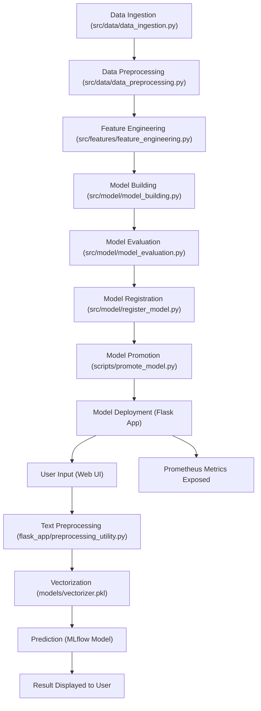

# Sentiment Analysis

A full-stack machine learning project for sentiment analysis, featuring a Flask web app, robust data pipelines, model training, evaluation, and deployment, with cloud integration and experiment tracking.

---

## Table of Contents

- [Project Structure](#project-structure)
- [Features](#features)
- [Setup & Installation](#setup--installation)
- [Usage](#usage)
- [Web Application](#web-application)
- [Data & Notebooks](#data--notebooks)
- [Model Training & Evaluation](#model-training--evaluation)
- [Cloud & Experiment Tracking](#cloud--experiment-tracking)
- [Testing](#testing)
- [Documentation](#documentation)
- [Contributing](#contributing)
- [License](#license)

---

## Project Structure

```
YT-Capstone-Project-main/
│
├── flask_app/                # Flask web app for sentiment prediction
│   ├── app.py                # Main Flask application
│   ├── load_model_test.py    # Model loading test script
│   ├── preprocessing_utility.py # Text preprocessing utilities
│   ├── requirements.txt      # Flask app dependencies
│   └── templates/
│       └── index.html        # Web UI template
│
├── src/                      # Core Python package
│   ├── connections/          # Cloud and DB connection utilities
│   │   ├── s3_connection.py
│   │   ├── ssms_connection.py
│   │   └── config.json
│   ├── data/                 # Data pipeline scripts (empty/.gitkeep)
│   ├── features/             # Feature engineering
│   │   └── feature_engineering.py
│   ├── logger/               # Logging utilities
│   ├── model/                # Model training, evaluation, registration
│   │   ├── model_building.py
│   │   ├── model_evaluation.py
│   │   ├── predict_model.py
│   │   ├── register_model.py
│   │   └── train_model.py
│   └── visualization/        # Visualization scripts
│       └── visualize.py
│
├── notebooks/                # Jupyter notebooks and experiments
│   ├── exp1.ipynb
│   ├── exp2_bow_vs_tfidf.py
│   ├── exp3_lor_bow_hp.py
│   ├── data.csv
│   └── IMDB.csv
│
├── models/                   # Trained models and vectorizers
│
├── scripts/                  # Utility scripts
│   └── promote_model.py
│
├── tests/                    # Unit and integration tests
│   ├── test_flask_app.py
│   └── test_model.py
│
├── docs/                     # Sphinx documentation
│   ├── index.rst
│   ├── getting-started.rst
│   ├── commands.rst
│   └── conf.py
│
├── deployment.yaml           # Deployment configuration
├── dvc.yaml, dvc.lock        # DVC pipeline files
├── requirements.txt          # Project-wide dependencies
├── setup.py                  # Python package setup
├── Makefile                  # Automation commands
├── LICENSE
└── README.md                 # (You are here!)
```

---

## Project Flowchart

Below is a complete end-to-end flowchart of the project, from data ingestion to user prediction and monitoring:



---

## Features

- **Flask Web App** for real-time sentiment prediction with a user-friendly UI.
- **Text Preprocessing**: Lemmatization, stopword removal, punctuation/number/url cleaning.
- **ML Pipeline**: Feature engineering, model training, evaluation, and registration.
- **Cloud Integration**: S3 and SQL Server connections for data and model storage.
- **Experiment Tracking**: MLflow and DagsHub integration for reproducible experiments.
- **Prometheus Metrics**: Custom metrics for monitoring app usage and prediction stats.
- **Jupyter Notebooks**: For exploratory data analysis and model experimentation.
- **Testing**: Unit and integration tests for robust development.
- **Documentation**: Sphinx-based docs for easy onboarding.

---

## Setup & Installation

### 1. Clone the Repository

```bash
git clone <your-repo-url>
cd YT-Capstone-Project-main
```

### 2. Install Dependencies

#### For the full project:
```bash
pip install -r requirements.txt
```

#### For the Flask app only:
```bash
cd flask_app
pip install -r requirements.txt
```

### 3. Environment Variables

Set the following environment variables for cloud and experiment tracking:

- `CAPSTONE_TEST` (DagsHub/MLflow token)
- `AWS_ACCESS_KEY`, `AWS_SECRET_KEY` (for S3, if used)

You can use a `.env` file (not included/tracked for security).

---

## Usage

### Run the Flask Web App

```bash
cd flask_app
python app.py
```

- The app will be available at `http://localhost:5000/`
- Use the web UI to input text and get sentiment predictions (positive or negative).

### Prometheus Metrics

- Metrics are available at `http://localhost:5000/metrics`

---

## Web Application

- **UI**: Simple, clean interface for entering text and viewing predictions.
- **Endpoints**:
  - `/` : Home page with input form.
  - `/predict` : Handles prediction requests.
  - `/metrics` : Exposes Prometheus metrics.

---

## Data & Notebooks

- **notebooks/** contains:
  - Data files (`data.csv`, `IMDB.csv`)
  - Experiment notebooks and scripts for feature comparison, hyperparameter tuning, etc.

---

## Model Training & Evaluation

- **src/model/** contains scripts for:
  - Building, training, and evaluating models.
  - Registering models with MLflow/DagsHub.
  - Predicting with trained models.

- **src/features/** for feature engineering.
- **src/connections/** for S3 and SQL Server integration.

---

## Cloud & Experiment Tracking

- **MLflow** and **DagsHub** are used for experiment tracking and model registry.
- **S3** integration for data/model storage (see `src/connections/s3_connection.py`).

---

## Testing

- **tests/** contains:
  - `test_flask_app.py`: Tests for the Flask app.
  - `test_model.py`: Tests for model pipeline.

Run tests with:
```bash
pytest tests/
```

---

## Documentation

- **docs/** contains Sphinx documentation.
- Build docs with:
  ```bash
  cd docs
  make html
  ```
- See `docs/getting-started.rst` for setup instructions.

---

## Contributing

1. Fork the repo and create your branch.
2. Add/commit your changes.
3. Ensure all tests pass.
4. Submit a pull request.

---

## License

This project is licensed under the MIT License. See [LICENSE](LICENSE) for details.

---

**Note:**  
- No credentials or sensitive data are tracked in git.  
- Add your own `.env` and update `.gitignore` as needed. 